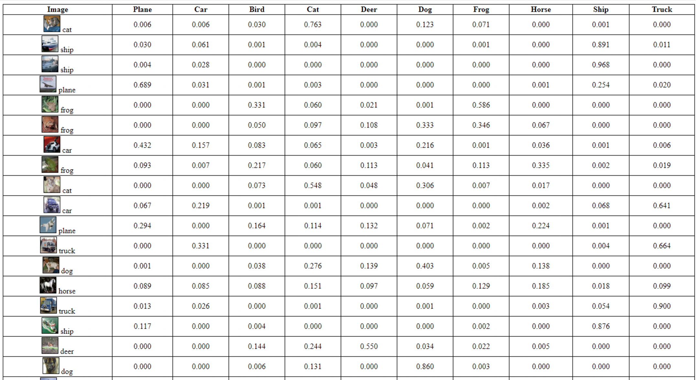

# PyTorch Toy Projects 

### Content
| # | Name                                  | Description                                                 | Teaser                |
|---|---------------------------------------|-------------------------------------------------------------|-----------------------|
| 1 | [Fine-Tuning a Pre-Trained Network](cifar)   | Build upon ResNet20 trained for CIFAR-100 image classification, generate HTML output displaying classification scores results  |   |